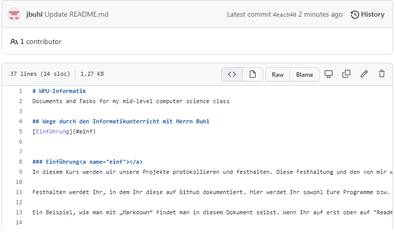

# WPU-Informatik
Documents and Tasks for my mid-level computer science class

## Wege durch den Informatikunterricht mit Herrn Buhl
[Einführung](#einf)    

### Einführung 
In diesem Kurs werden wir unsere Projekte protokollieren und festhalten. Diese Festhaltung und den von mir wahrgenommenen Fortschritt und Engagement werden die Grundlagen für Eure Note in diesem Kurs bilden. 

Festhalten werdet Ihr, in dem Ihr diese auf Github dokumentiert. Hier werdet Ihr sowohl Eure Programme bzw. Euren Quelltext als auch Dokumentation hierzu (in der sehr vereinfachten, HTML-ähnlichen Sprache „Markdown“) ablegen. 

Ein Beispiel, wie man mit „Markdown“ findet man in diesem Dokument selbst. Wenn Ihr auf erst oben auf "Readme.md" klickt:

und dann oberhalb des Texts auf das "<>"-Zeichen klickt, 

seht Ihr den Quelltext für diese Seite: 

Indem Ihr guckt, wie bestimmte Strukturen (Überschriften, Links, Bilder-Einbinden, etc.) gemacht werden, lernt Ihr, wie Ihr sie für die eigene Projektbeschreibungen, etc., machen könnt.

